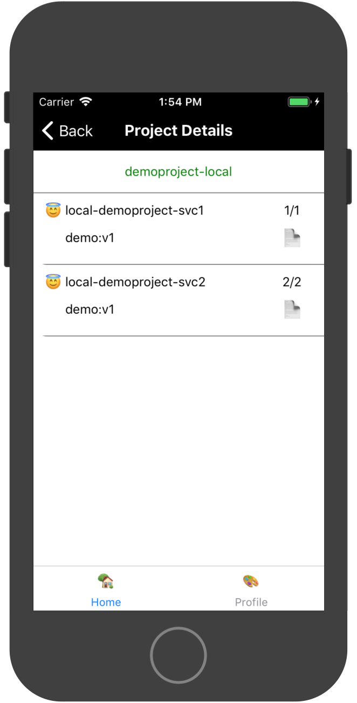

# monitor

2018/12/21

## init backend api

### init data in etcd

```bash
ETCDCTL_API=3 /usr/local/bin/etcdctl put /monitor/local/projects '{"env":"local","data":[{"icon":"👼","name":"demo1","status":"1"},{"icon":"😇","name":"demoproject","status":"1"}]}'


ETCDCTL_API=3 /usr/local/bin/etcdctl put /monitor/local/accessToken/xxx true
ETCDCTL_API=3 /usr/local/bin/etcdctl put /monitor/local/accessToken/yyy false

```

### run backend on Linux

```bash
test $(docker ps -a -f name=monitor -q |wc -l) -eq 0 || \
docker rm -f monitor

docker run -d --restart always \
    --name monitor \
    -p "80:12000" \
    -v /var/run/docker.sock:/var/run/docker.sock \
    -v /etc/localtime:/etc/localtime \
    -e ETCD_BACKEND_NODES="127.0.0.1:2379" \
    -e LOG_LEVEL="debug" \
    opera443399/monitor

docker logs --tail 100 --since 5m -f monitor

```

### run backend on Mac

```bash
test $(docker ps -a -f name=monitor -q |wc -l) -eq 0 || \
docker rm -f monitor

docker run -d --restart always \
    --name monitor \
    -p "80:12000" \
    -v /var/run/docker.sock:/var/run/docker.sock \
    -e ETCD_BACKEND_NODES="127.0.0.1:2379" \
    -e LOG_LEVEL="debug" \
    opera443399/monitor

docker logs --tail 100 --since 5m -f monitor

```

## init app

### init rn

```bash
# react-native init yourProjectName
# cd yourProjectName
# yarn add react-navigation
# yarn add react-native-gesture-handler
# react-native link react-native-gesture-handler

```

### run

copy `App.js` and `css.js` to your project, then run the demo on your simulator or device

## snapshots



